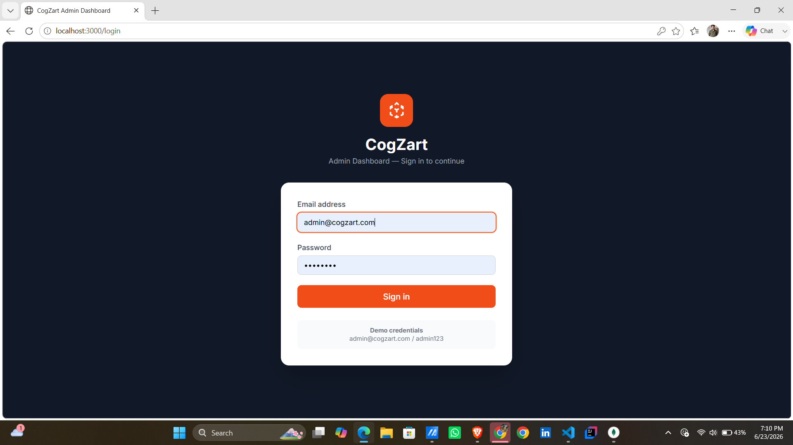
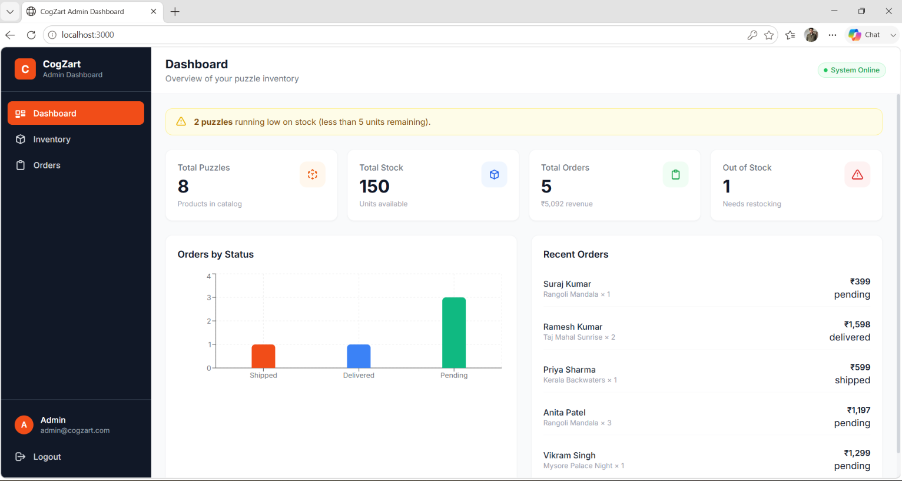
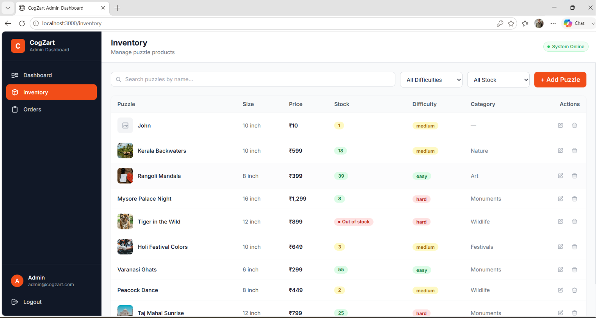
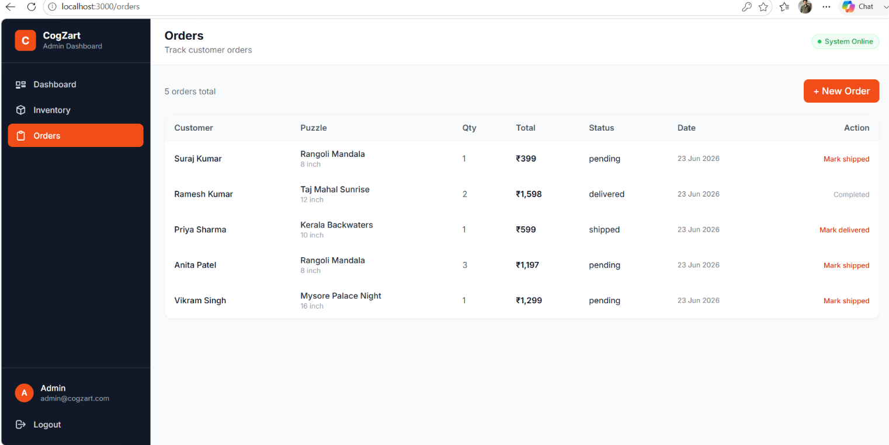

# CogZart Puzzle Admin Dashboard

A full-stack admin dashboard for managing puzzle inventory and orders — built as part of the CogZart Web Developer Assessment.

---

## 📸 Features Implemented

- **Authentication** — JWT-based login, hardcoded admin credentials, token stored in localStorage
- **Dashboard** — KPI cards (total puzzles, stock, orders, out-of-stock), bar chart of orders by status, recent orders list, low-stock warning banner
- **Puzzle Inventory** — Full CRUD (add, edit, delete, list), stock indicator, difficulty badges, image preview, search by name, filter by difficulty and stock availability
- **Orders** — Create orders (auto-calculates total, deducts stock), view all orders, advance order status (pending → shipped → delivered)
- **Bonus Features**: Toast notifications, low-stock warning indicator (< 5 units), sales analytics chart (Recharts), responsive sidebar navigation

---

## 🛠 Tech Stack

**Frontend**
- React 18 (Vite)
- Tailwind CSS
- React Router v6
- Axios
- Recharts

**Backend**
- Node.js + Express
- MongoDB + Mongoose
- JWT (jsonwebtoken)
- bcryptjs

---

## 📁 Project Structure

```
cogzart/
├── frontend/              # React (Vite) app
│   ├── src/
│   │   ├── components/    # Reusable UI components
│   │   │   ├── Layout/    # Sidebar, Header, Modal
│   │   │   ├── Dashboard/ # StatCard
│   │   │   └── Inventory/ # PuzzleForm
│   │   ├── context/       # AuthContext, ToastContext
│   │   ├── pages/         # LoginPage, DashboardPage, InventoryPage, OrdersPage
│   │   └── utils/         # api.js (Axios instance)
│   ├── index.html
│   ├── vite.config.js
│   └── tailwind.config.js
│
└── backend/               # Node.js + Express API
    ├── config/            # db.js (MongoDB connection)
    ├── models/            # Puzzle.js, Order.js
    ├── controllers/       # authController, puzzleController, orderController
    ├── routes/            # authRoutes, puzzleRoutes, orderRoutes
    ├── middleware/        # authMiddleware.js (JWT protect)
    ├── seed.js            # Sample data seeder
    └── server.js          # Entry point
```

---

## 🚀 Setup Instructions

### Prerequisites
- Node.js v18+
- MongoD
- Git

---

### 1. Clone the repository

```bash
git clone https://github.com/YOUR_USERNAME/cogzart-dashboard.git
cd cogzart-dashboard
```

---

### 2. Backend Setup

```bash
cd backend
npm install
```

Create a `.env` file (copy from example):
```bash
cp .env.example .env
```

Edit `.env`:
```
PORT=5000
MONGO_URI=mongodb://localhost:27017/cogzart
JWT_SECRET=cogzart_super_secret_key_2024
NODE_ENV=development
```

Seed the database with sample data:
```bash
node seed.js
```

Start the backend:
```bash
npm run dev       # development (nodemon)
# or
npm start         # production
```

The API will be available at `http://localhost:5000`

---

### 3. Frontend Setup

```bash
cd ../frontend
npm install
npm run dev
```

The app will open at `http://localhost:3000`

---

### 4. Login Credentials

```
Email:    admin@cogzart.com
Password: admin123
```

---

## 🔌 API Endpoints

| Method | Endpoint              | Description            | Auth |
|--------|-----------------------|------------------------|------|
| POST   | /api/auth/login       | Admin login            | ✗    |
| GET    | /api/auth/verify      | Verify token           | ✓    |
| GET    | /api/puzzles          | Get all puzzles        | ✓    |
| GET    | /api/puzzles/stats    | Dashboard stats        | ✓    |
| POST   | /api/puzzles          | Add puzzle             | ✓    |
| PUT    | /api/puzzles/:id      | Update puzzle          | ✓    |
| DELETE | /api/puzzles/:id      | Delete puzzle          | ✓    |
| GET    | /api/orders           | Get all orders         | ✓    |
| POST   | /api/orders           | Create order           | ✓    |
| PUT    | /api/orders/:id       | Update order status    | ✓    |

Query params for `GET /api/puzzles`:
- `search` — Search by name
- `difficulty` — Filter by difficulty (easy / medium / hard)
- `inStock` — Filter by availability (true / false)


## 📊 Bonus Features Implemented

- ✅ Toast notifications (slide-in/out animations)
- ✅ Low stock warning indicator (stock < 5 units — yellow banner + table highlights)
- ✅ Sales analytics chart (bar chart of orders by status via Recharts)

## Login Page



## Dashboard



## Inventory Page



## Order.png
